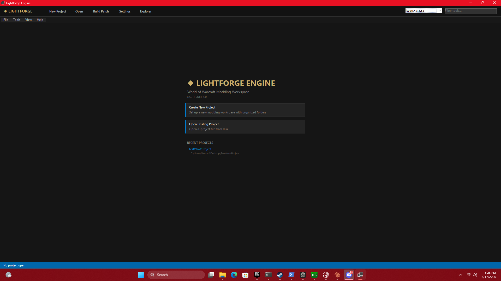
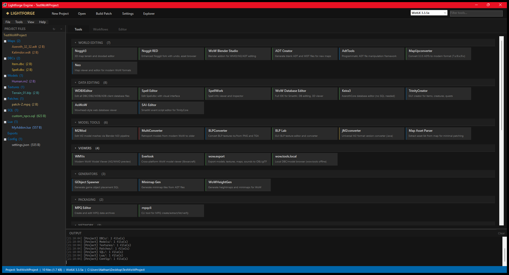
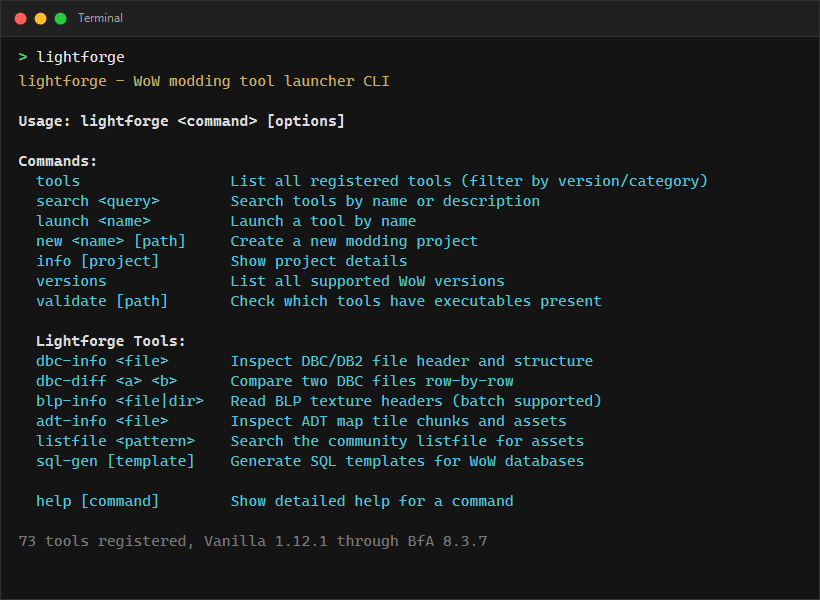

# Lightforge Engine

[](https://github.com/Krilliac/Lightforge/releases/latest)
[](https://github.com/Krilliac/Lightforge/releases)
[](https://dotnet.microsoft.com/download/dotnet/8.0)
[](LICENSE)

A unified workspace for World of Warcraft modding, bringing 60+ community tools under one roof with project management, version-aware tool filtering, and a built-in file editor. Includes a CLI for scripting and automation.





## Download

**[Download Latest Release](https://github.com/Krilliac/Lightforge/releases/latest)** -- Pre-built binaries for Windows.

- `Lightforge-v2.0.0-gui.zip` -- GUI application (WinForms)
- `Lightforge-v2.0.0-cli.zip` -- Command-line tool

Both require the [.NET 8 Runtime](https://dotnet.microsoft.com/download/dotnet/8.0/runtime).

## What It Does

Lightforge organizes the scattered landscape of WoW modding tools into a single launcher with project-based workflows. Instead of hunting for executables across dozens of folders, you select your target expansion and Lightforge shows only the tools that work with that version.

**Key features:**

- **Project system** -- Create workspaces with organized folders (Maps, DBCs, Models, Textures, Patches, SQL, Lua, Exports, Config). Projects remember their target expansion, client path, and recent files.
- **63 tools, 8 WoW versions** -- Covers Vanilla 1.12.1 through BfA 8.3.7. Tools are filtered live by the selected expansion so you never launch something incompatible.
- **Built-in file editor** -- Tabbed editor with syntax highlighting for SQL, Lua, XML, GLSL, and config files. Supports find-in-files (Ctrl+Shift+F) across your entire project.
- **CLI for automation** -- List, search, and launch tools from the command line. Create projects, validate tool installations, and export JSON for scripting.
- **Tool status at a glance** -- Each tool card shows its maintenance status (Active, Maintained, Stable, Stale, Archived) with color-coded indicators, plus right-click context menus for opening source repos, containing folders, or launching directly.
- **Drag-and-drop** -- Drop files onto the project tree to import them into the right folder.
- **Build system** -- One-click "Build Patch" creates a ZIP of your project's output, ready for distribution.
- **File watching** -- The project tree auto-refreshes when files change on disk.

## Supported Versions

| Version | Build | Archive Format | Tool Count |
|---------|-------|----------------|------------|
| Vanilla 1.12.1 | 5875 | MPQ | 52 |
| TBC 2.4.3 | 8606 | MPQ | 51 |
| WotLK 3.3.5a | 12340 | MPQ | 64 |
| Cata 4.3.4 | 15595 | MPQ | 29 |
| MoP 5.4.8 | 18414 | MPQ | 27 |
| WoD 6.2.4 | 21742 | CASC | 25 |
| Legion 7.3.5 | 26972 | CASC | 27 |
| BfA 8.3.7 | 35662 | CASC | 26 |

The version selector in the toolbar filters the tool panel to show only compatible tools. Select "All Versions" to see everything.

## Tool Categories

| Category | Examples | Description |
|----------|----------|-------------|
| **World Editing** | Noggit3, Noggit RED, WoW Blender Studio, Neo | Terrain, ADT, and map editors |
| **Data Editing** | WDBXEditor, Spell Editor, Keira3, WoW Database Editor | DBC/DB2 and database editors |
| **Model Tools** | M2Mod, MultiConverter, BLPConverter, BLP Lab | M2/WMO model and texture converters |
| **Viewers** | WMVx, wow.export, Everlook | 3D model and asset viewers |
| **Generators** | ADT Creator, Minimap Gen, WoWHeightGen | Procedural content generation |
| **Packaging** | MPQ Editor, CASCExplorer, CASCHost, mpqcli | Archive read/write for both formats |
| **Network** | WowPacketParser, ymir, SzimatSzatyor | Packet capture and analysis |
| **Client Patching** | wow-patcher, VanillaFixes, Arctium Launcher | Client binary modification |
| **Retroporting** | Retroporting Scripts, GOB Retroport | Asset conversion between versions |
| **Server Admin** | AzerothAdmin, TSWoW, SPP Legion Admin | Server management utilities |
| **Libraries** | warcraft-rs, StormLib, CASCLib, DBCD, Warcraft.NET | Programmatic file format access |
| **ADT CLI Tools** | 18 command-line ADT utilities | Cryect/Schlumpf terrain batch tools |

See [SOURCES.md](SOURCES.md) for the complete catalog with source links and version compatibility.

## Command Line Interface

The `lightforge` CLI provides terminal access to the full tool catalog.

```
$ lightforge
lightforge - WoW modding tool launcher CLI

Usage: lightforge <command> [options]

Commands:
  tools                 List all registered tools (filter by version/category)
  search <query>        Search tools by name or description
  launch <name>         Launch a tool by name
  new <name> [path]     Create a new modding project
  info [project]        Show project details
  versions              List all supported WoW versions
  validate [path]       Check which tools have executables present
  help [command]        Show detailed help for a command

  Lightforge Tools:
  dbc-info <file>       Inspect DBC/DB2 file header and structure
  dbc-diff <a> <b>      Compare two DBC files row-by-row
  blp-info <file|dir>   Read BLP texture headers (batch supported)
  adt-info <file>       Inspect ADT map tile chunks and assets
  listfile <pattern>    Search the community listfile for assets
  sql-gen [template]    Generate SQL templates for WoW databases

  help [command]        Show detailed help for a command

73 tools registered, Vanilla 1.12.1 through BfA 8.3.7
```

### Built-in Tools

The CLI includes custom tools that fill gaps in the community toolkit:

| Tool | Description |
|------|-------------|
| `dbc-info` | Inspect DBC/DB2 file headers -- record count, field count, string block stats, format version (WDBC/WDB2/WDB5/WDB6) |
| `dbc-diff` | Compare two DBC files row-by-row -- shows added, removed, and modified records with field-level detail (`--verbose`) |
| `blp-info` | Read BLP texture headers -- dimensions, compression type (DXT1/DXT3/DXT5/palette), mip chain, VRAM estimate. Supports batch mode on directories |
| `adt-info` | Inspect ADT map tiles -- chunk layout, texture/model/WMO lists, doodad and WMO placement counts |
| `listfile` | Search the community listfile CSV for WoW client assets by name pattern. Supports glob wildcards and extension filtering |
| `sql-gen` | Generate ready-to-fill SQL INSERT templates for TrinityCore/AzerothCore: items, creatures, quests, spawns, vendors, loot, gossip, trainers, waypoints, SmartAI |



### Examples

List tools for a specific expansion:

```
$ lightforge tools --version wotlk --compact
Noggit3                      WORLD EDITING    Vanilla, TBC, WotLK
WDBXEditor                   DATA EDITING     Vanilla, TBC, WotLK, Cata, MoP, WoD, Legion, BfA
Spell Editor V2              DATA EDITING     Vanilla, TBC, WotLK
MPQ Editor                   PACKAGING        Vanilla, TBC, WotLK, Cata, MoP
...
```

Search tools:

```
$ lightforge search mpq
● MPQ Editor                PACKAGING        MPQ archive editor
  http://www.zezula.net/en/mpq/download.html
  Versions: Vanilla, TBC, WotLK, Cata, MoP
● mpqcli                    PACKAGING        Command-line MPQ archiver
  https://github.com/TheGrayDot/mpqcli
  Versions: Vanilla, TBC, WotLK, Cata, MoP
```

Show version coverage:

```
$ lightforge versions
  Supported WoW Versions

  Version              Build    Format Tools
  Vanilla 1.12.1       5875     MPQ    52
  TBC 2.4.3            8606     MPQ    51
  WotLK 3.3.5a         12340    MPQ    64
  Cata 4.3.4           15595    MPQ    29
  MoP 5.4.8            18414    MPQ    27
  WoD 6.2.4            21742    CASC   25
  Legion 7.3.5         26972    CASC   27
  BfA 8.3.7            35662    CASC   26

  73 total tools registered
```

Export as JSON for scripting:

```bash
lightforge tools --json > tools.json
lightforge tools --version wotlk --category "DATA EDITING" --json
```

## Building

**Requirements:** .NET 8 SDK, Windows 10/11

```bash
dotnet build Lightforge.sln -c Release
```

This builds both the GUI and CLI:

| Output | Path |
|--------|------|
| GUI | `Lightforge/bin/Release/net8.0-windows/Lightforge.exe` |
| CLI | `Lightforge.CLI/bin/Release/net8.0/lightforge.exe` |

To have tools available, run the built-in setup command to auto-download from GitHub releases:

```bash
lightforge setup              # download all available tools
lightforge setup --list       # see what's available vs installed
lightforge setup -t Noggit3   # download a specific tool
```

24 tools have automated downloads configured. For tools without releases, place their executables under a `Toolset Binaries` folder next to the executable, matching the paths defined in `WowToolRegistry.cs`.

## Project Structure

```
Lightforge/
  Lightforge/
    Mainform.cs            # Main window, workspace UI, editor, menus
    Theme.cs               # Dark theme color/font definitions
    WowToolRegistry.cs     # Tool catalog with version compatibility model
    LightforgeProject.cs   # Project create/open/save and recent projects
    Lightforge.csproj      # .NET 8 WinForms project file
  Lightforge.CLI/
    Program.cs             # CLI entry point and commands
    Lightforge.CLI.csproj  # Console app (links shared source files)
  patches/                 # Version-extension patches for upstream tools
  docs/                    # Documentation and screenshots
  SOURCES.md               # Complete tool source catalog
```

## Keyboard Shortcuts

| Shortcut | Action |
|----------|--------|
| `Ctrl+N` | New project |
| `Ctrl+O` | Open project |
| `Ctrl+S` | Save active file |
| `Ctrl+W` | Close active editor tab |
| `Ctrl+B` | Build patch (ZIP export) |
| `Ctrl+Shift+F` | Find in files |
| `F5` | Refresh file tree |

## Patches

The `patches/` directory contains version-extension patches for upstream tools. Some tools work with more WoW versions than originally labeled because the underlying binary formats are identical (e.g., ADT MVER=18 is the same across Vanilla, TBC, and WotLK). Others need source code changes.

See [patches/README.md](patches/README.md) for the full list and instructions.

## Documentation

Detailed documentation is in the [docs/](docs/) folder:

- [Architecture](docs/architecture.md) -- Codebase structure and design decisions
- [Tool Catalog](docs/tool-catalog.md) -- Complete tool reference with version details
- [Version Compatibility](docs/version-compatibility.md) -- WoW format differences by expansion
- [Adding Tools](docs/adding-tools.md) -- How to register new tools in the launcher
- [Project System](docs/project-system.md) -- How projects and workspaces work

## License

This project aggregates and launches community-developed tools. Each tool retains its own license. Lightforge itself is provided as-is for the WoW modding community.
